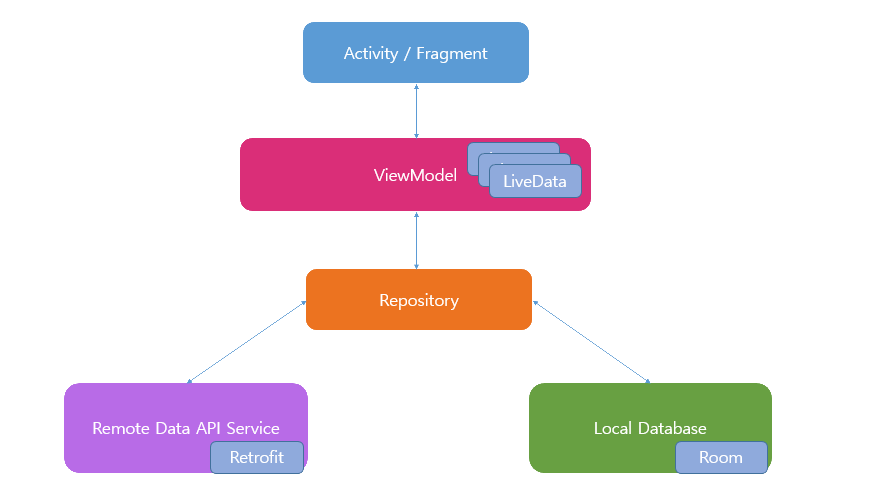

<h1 align="center">PagingKotlin</h1>

<p align="center">  
The Paging Library helps you in the loading of heavy-data with endless scrolling or infinite scrolling.<br>
You can load and display small chunks of data at a time which can eventually reduce the usage of network bandwidth and system resources.
</p>

<p align="center">
  <a href="https://opensource.org/licenses/Apache-2.0"></a>
  <a href="https://android-arsenal.com/api?level=21"></a>
  <a href="https://medium.com/@yash786agg/dagger-hilt-an-introduction-and-migrating-from-dagger-android-520bf491c6b6"></a>
</p>


## Download
Go to the [Demo APK](https://github.com/yash786agg/PagingKotlin/tree/master/demo_apks) to download the latest APK.

## Tech stack & Open-source libraries
- Minimum SDK level 21
- [Kotlin](https://kotlinlang.org/) based + [Coroutines](https://github.com/Kotlin/kotlinx.coroutines) for asynchronous.
- [Dagger-Hilt](https://developer.android.com/training/dependency-injection/hilt-android#kotlin) for dependency injection.
  - Hilt Data Binding - Implementing a binding adapter using the Android Data Binding Library.
- JetPack
  - LiveData - notify domain layer data to views.
  - Lifecycle - dispose of observing data when lifecycle state changes.
  - ViewModel - UI related data holder, lifecycle aware.
- Architecture
  - MVVM Architecture (View - DataBinding - ViewModel - Model)
- [Retrofit2 & OkHttp3](https://github.com/square/retrofit) - construct the REST APIs and paging network data.
- [Gson](https://github.com/google/gson) - A JSON serialization/deserialization library for Kotlin and Java.
- [Fresco](https://frescolib.org/) - A Image loading library.
- [Paging](https://developer.android.com/topic/libraries/architecture/paging) - A Paging Library helps you load and display small chunks of data at a time.   
- [Material-Components](https://github.com/material-components/material-components-android) - Material design components like ripple animation, cardView.

##Demo


## Architecture
The application is based on MVVM architecture and a repository pattern.



## Open API

PagingKotlin using the [FlickrAPI](https://www.flickr.com/services/api/) for constructing restful API.<br>
FlickrAPI provides a restful API for image and video service, as well as an online community.


Thanks for reading this repo. Be sure to click ★ below to recommend this repo if you found it helpful. It means a lot to me.

For more about programming, follow me on [Medium](https://medium.com/@yash786agg)

Also, Let’s become friends on [Linkedin](http://bit.ly/24t4EVI)

# License
```xml
Designed and developed by yash786agg (Yash Agarwal)

Licensed under the Apache License, Version 2.0 (the "License");
you may not use this file except in compliance with the License.
You may obtain a copy of the License at

   http://www.apache.org/licenses/LICENSE-2.0

Unless required by applicable law or agreed to in writing, software
distributed under the License is distributed on an "AS IS" BASIS,
WITHOUT WARRANTIES OR CONDITIONS OF ANY KIND, either express or implied.
See the License for the specific language governing permissions and
limitations under the License.
```
